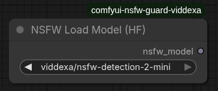
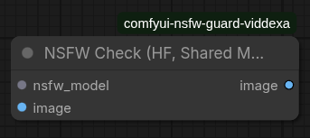
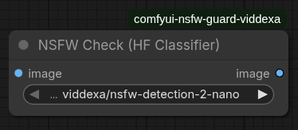

# ComfyUI NSFW Guard (Viddexa)

Custom ComfyUI nodes for NSFW filtering with Viddexa models.

Supported model repositories:
- `viddexa/nsfw-detection-2-nano`
- `viddexa/nsfw-detection-2-mini`

Preferred backend:
- `moderators` (PyPI)

Fallback backend:
- `transformers`

## Installation

1. Go to your ComfyUI `custom_nodes` folder:

```bash
cd ComfyUI/custom_nodes
```

2. Clone this repository:

```bash
git clone https://github.com/Trunk-png/comfyui-nsfw-guard-viddexa.git
```

3. Install dependencies:

```bash
pip install -r comfyui-nsfw-guard-viddexa/requirements.txt
```

4. Restart ComfyUI.

## NSFW Policy

- Blocked classes: `porn`, `hentai`, `sexy`
- Allowed classes: `safe`, `drawing`

When NSFW is detected, the node:
- sends `nsfw_guard.content_blocked`
- calls `interrupt_processing(True)`
- raises an error with type `nsfw_content_detected`

## Nodes and Images

### 1) **NSFW Load Model (HF)**



What this node does:
- Loads one selected model (`nano` or `mini`)
- Outputs `NSFW_GUARD_MODEL`
- Lets you reuse the same loaded model across multiple check nodes

### 2) **NSFW Check (HF, Shared Model)**



What this node does:
- Takes `nsfw_model` from **NSFW Load Model (HF)**
- Takes `image` input
- Optional input: `block_policy` from policy nodes
- Classifies the image and blocks if predicted class is `porn`, `hentai`, or `sexy`
- Passes image through if class is `safe` or `drawing`

### 3) **NSFW Check (HF Classifier)** (single node)



What this node does:
- Combines model loading + NSFW check in one node
- Simpler to use for one check point
- For multi-point checking (input + output), the shared-model flow is more efficient

## Recommended Workflow (Load Once, Check Multiple Times)

```text
                 +-> [NSFW Check (HF, Shared Model)] -> (input-side check)
[NSFW Load Model]
                 +-> [NSFW Check (HF, Shared Model)] -> (output-side check)
```

This loads the model once and reuses it.

## Extra Policy Nodes

### NSFW Filter Policy (Level 1-4)

Level mapping:
- Level 1: block `porn`
- Level 2: block `porn`, `hentai`
- Level 3: block `porn`, `hentai`, `sexy`
- Level 4: block `porn`, `hentai`, `sexy`, `drawing`

### NSFW Filter Policy (Label Table)

Available labels:
- `porn`
- `hentai`
- `sexy`
- `drawing`
- `normal`

You can select one or multiple labels to block, then connect the output to `block_policy` on check nodes.

## Reference of model check NSFW

- [viddexa/nsfw-detection-2-mini](https://huggingface.co/viddexa/nsfw-detection-2-mini)
- [viddexa/nsfw-detection-2-nano](https://huggingface.co/viddexa/nsfw-detection-2-nano)
